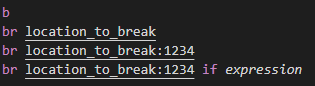
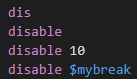
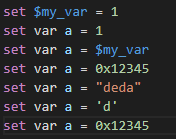

# gdb-syntax README

VSCode grammar file to color higlight commands file for gdb

## Features

This extention provides a grammar file to parse and color GDB command files.

Example

## Requirements

* VSCode > 1.45.0

## Release Notes

### 0.0.3

#### Added

* run
* file
* break 

  

* step
* enable/disable

* enable & disable

  
* set variable and conveniance variable from constant values

  
* handle

  

#### Implemented
* comment, continue, break, next

## Roadmap

Include more commands from [GDB commands, variable and function index](https://sourceware.org/gdb/current/onlinedocs/gdb/Command-and-Variable-Index.html#Command-and-Variable-Index).

