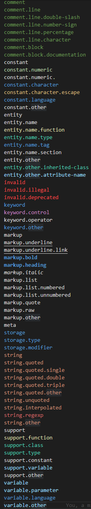

# gdb-syntax README

VSCode grammar file to color higlight command files for GDB

## Features

This extension provides a grammar file to parse and color GDB command files.

Unlike other languague, GDB will accept incomplete word when there's no ambiguity, 
so `set loggging overwrite off` is as valid as `set lo ov of`.

That means that you just can't put every keyword in one regexp to render each keyword.
To have a consistant color hilight each command has it's own regexp.

Disclaimer: for the moment, all the commands that I use are rendered.
Commits will slow down. May not update at all.

## Changelog

## [0.1.5] 2023-02-04
### Merged
 * python oneliner command
### Added 
 * python-interactive command

## Roadmap
 * Nothing. on standby
 * more from [GDB commands, variable and function index](https://sourceware.org/gdb/onlinedocs/gdb/Command-and-Variable-Index.html).

## Contributors
### Rules
* All scopes must finish by `.gdb`.
* The scope goes from general to specific.
* For GDB commands, first scope is  `meta`.
    * Then it depends on the GDB logic: is it a `command`, a `comment`, a `variable` ?
        * Then the next scope details the command, variable. And more if necessary.

Examples:
* `meta.block.conditional.gdb` means its a GDB block of text in a conditional statement.
* `string.quoted.double` is how we render any double quoted string inside our GDB scope.

### Testing
Use the VSCode command `editor.action.inspectTMScopes` ( `Developer: Inspect Editor Tokens and Scopes` in command palette ) to check the syntax highlighting.

Here, the comment was rendered as a `comment.line.number-sign.gdb`.

### Theme colors
The VSCode color theme gives the different scope and their colors.
You can use it to look for a particular effect.

