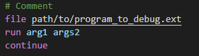

# gdb-syntax README

VSCode grammar file to color higlight commands file for gdb

## Features

This extension provides a grammar file to parse and color GDB command files.

Disclaimer: for the moment, all the commands that I use are rendered.
Commits will slow down. May not update at all.

## [0.1.0] 2020-06-15
### Added
* Python command block
* set auto-load python-scripts/local-gdbinit/safe-path
* set history save
* .gdbinit extension

## Roadmap
* skip command
* set subcommands
* and more from [GDB commands, variable and function index](https://sourceware.org/gdb/current/onlinedocs/gdb/Command-and-Variable-Index.html#Command-and-Variable-Index).

