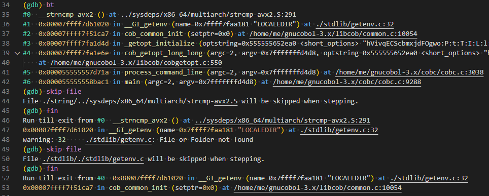

# GDB syntax color

[  ](https://marketplace.visualstudio.com/items?itemName=pierre-payen.gdb-syntax)

[ ](https://open-vsx.org/extension/pierre-payen/gdb-syntax)

VSCode grammar extension to color higlight scripts for GDB and GDB outputs logs.

## [0.6.3] 2025-04-28
### added
 * frame, select-frame
 * up, up-silently
 * down, down-silently

Disclaimer: for the moment, all the commands that I use are rendered.
Commits will slow down. May not update at all.

## Features

This extension provides a grammar file to parse and color GDB command files.
* `file.gdb` will be treated as gdb source files


* **EXPERIMENTAL** `file.gdb-log`, `file.gdblog`, `file.gdb.log` will be treated as gdb output logs.



Unlike other languague, GDB will accept incomplete word when there's no ambiguity, 
so `set loggging overwrite off` is as valid as `set lo ov of`.

That means that you just can't put every keyword in one regexp to render each keyword.
To have a consistant color hilight each command has it's own regexp.


## References
 * [GDB commands, variable and function index](https://sourceware.org/gdb/onlinedocs/gdb/Command-and-Variable-Index.html)
 * [TextMate languages grammars](https://macromates.com/manual/en/language_grammars)
 * [Oniguruma regex](https://macromates.com/manual/en/regular_expressions#syntax_oniguruma)

## Contributors
### Rules
* All scopes must finish by `.gdb`.
* The scope goes from general to specific.
* For GDB commands, first scope is  `meta`. Then it depends on the GDB logic: is it a `command`, a `block`, a `variable` ? Examples:
    * `meta.block.conditional.gdb` means its a GDB block of text in a conditional statement.
    * `meta.command.delete.gdb` means its gdb's delerte command.
* One command per PR. The PR must have the .gdb to test it. Ideally, an image should be copied in the PR to show the output.

### Testing
Use the VSCode command `editor.action.inspectTMScopes` ( `Developer: Inspect Editor Tokens and Scopes` in command palette ) to check the syntax highlighting.

Here, the comment was rendered as a `comment.line.number-sign.gdb`.


One can use also the hello_world code lo launch GDB and check command. This can be launched with `make -C hello_world`.
Then several commands are available to writte test files given a command ( and prefix and suffix if necessary).
To print the list of commands
```
(gdb) help user-defined
	all_regex -- Given a word foo, writes the regex to match f, fo, foo
	check_test -- Source file and execute command in it
	create_test -- Given a prefix, a word and a suffix, write all gdb possibilities to a file
```
### Theme colors
See [images/naming-conventions.png](images/naming-conventions.png) for particular scopes and their visual effect.
